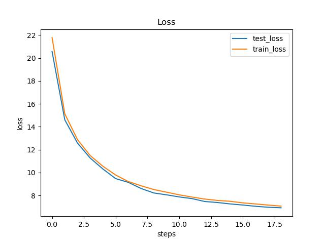

# Sound-Reconstruction-Using-VAE
<h3> Task Description </h3>

 In this task I tried to reconstruct the music using variational auto encoder. VAE consist of encoder and decoder network which provide a provide probabilistic manner for describing the latent space.

  

<figure>
   
   <figcaption>VAE (taken from Geek for geeks).</figcaption>
</figure>

 As shown in the above figure VAE consist of Encoder & Decoder, The bottleneck consist of latent space distribution which is nothing but mean & variance. We sample from these distribution which is passed through Decoder to reconstruct the Input.
VAE used two type of loss first is reconstruction loss and KL divergence loss. 

 

<h3> Feature Processing: </h3>
 <ul>
   <li> Load the wav file using Librosa. </li>
   <li> Set the sampling rate so it remain same through out all the file, Since i am using librosa sampling rate will always be 22050hz </li>
   <li> When we read wav file using librosa we get different number of sample, so to keep it of same sample size I perform padding and truncation step. </li>
   <li> In this step I used different approaches regarding feature preprocessing like STFT, MFCC, & MELSpectrogram followed by normalization or delta transformation </li>
 </ul>
 

<h3> Result: </h3>
<figure>
   
   <figcaption>Train/Test Loss.</figcaption>
</figure>
